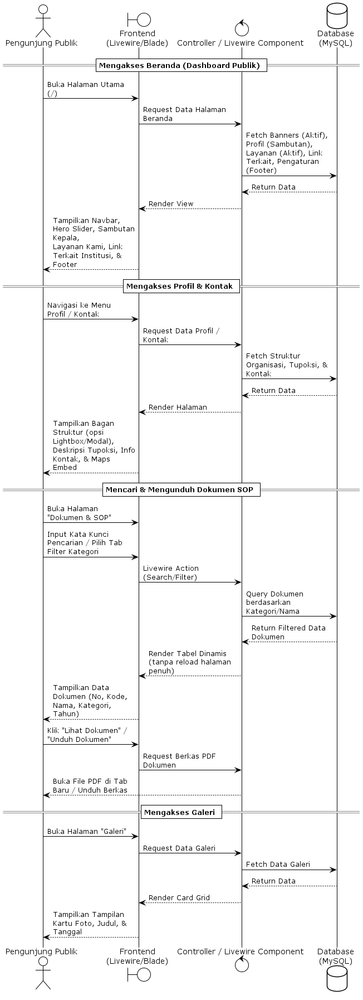
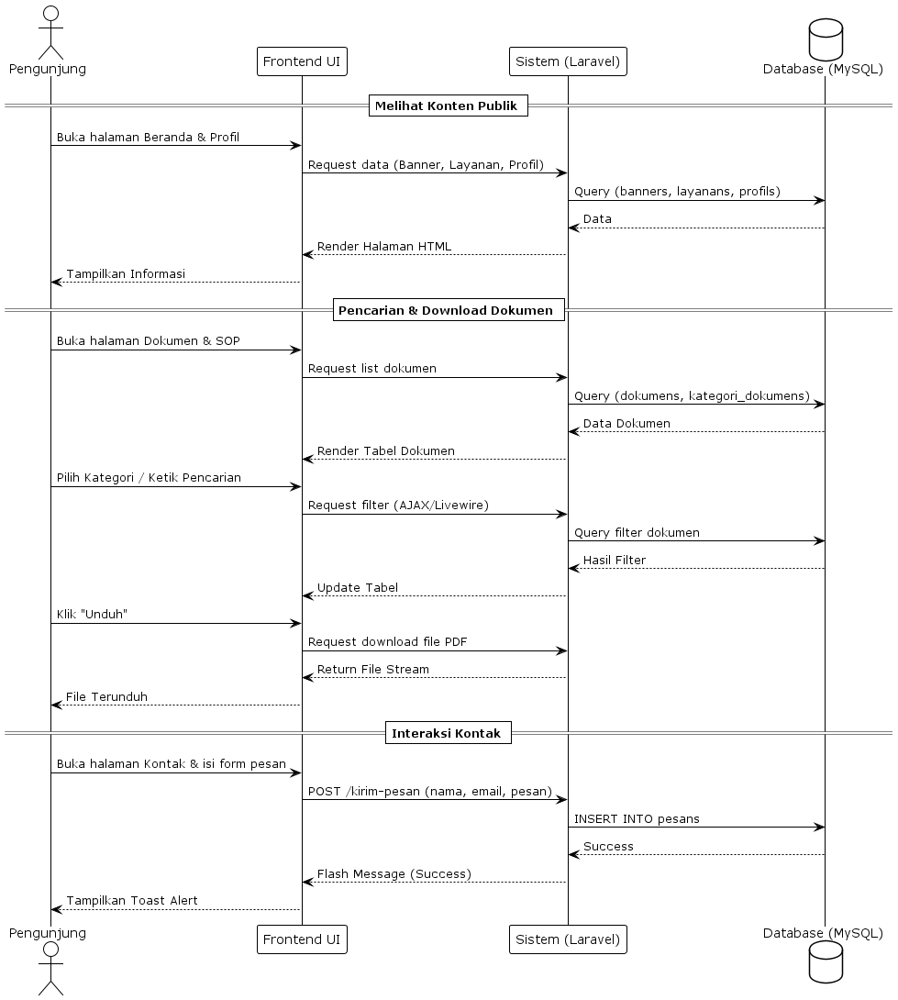
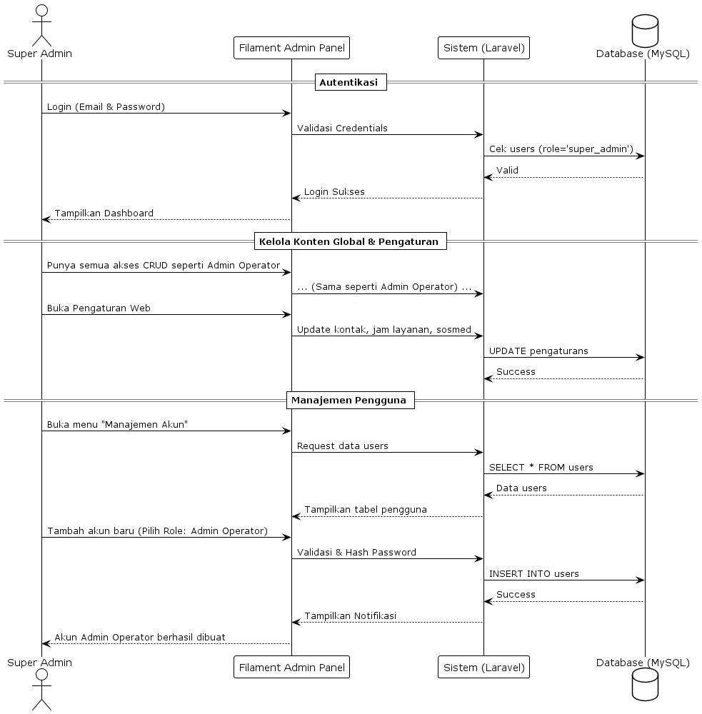
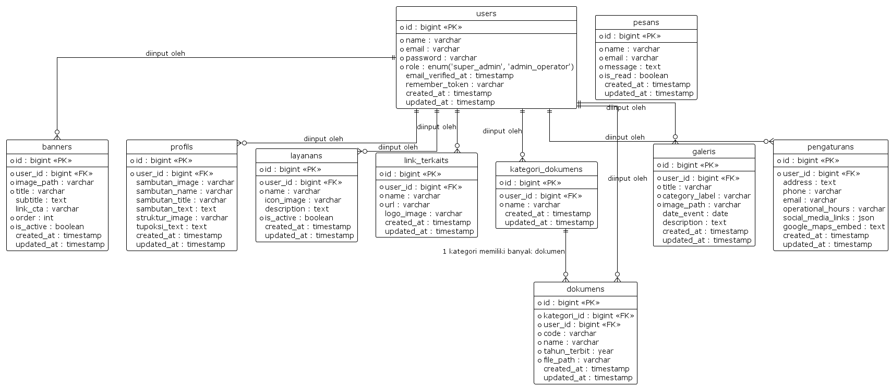

# Pusat Penjaminan Mutu - Poltekkes Kemenkes Medan

## Daftar Isi

- [Penjelasan Singkat](#penjelasan-singkat)
- [Tech Stack](#tech-stack)
- [Alur Aplikasi (Sequence Diagram)](#alur-aplikasi-sequence-diagram)
- [Database & ERD (Entity Relationship Diagram)](#database--erd-entity-relationship-diagram)
- [Setup Project](#setup-project)
- [Bagaimana Menjalankan Seeder](#bagaimana-menjalankan-seeder)
- [Mapping Menu Admin ke Frontend](#mapping-menu-admin-ke-frontend)
- [Penjelasan RBAC (Role-Based Access Control)](#penjelasan-rbac-role-based-access-control)
- [Design System](#design-system)

---

## Penjelasan Singkat

Proyek ini adalah sistem informasi CMS (Content Management System) yang dirancang khusus untuk **Pusat Penjaminan Mutu Poltekkes Kemenkes Medan**. Aplikasi ini memfasilitasi publikasi dokumen, layanan, galeri, serta informasi profil dan tugas fungsi organisasi kepada publik secara interaktif. Di saat yang bersamaan, sistem ini menyediakan panel admin yang sangat dinamis untuk mengelola keseluruhan konten web secara seketika (real-time) tanpa perlu menyentuh kode sumber.

## Tech Stack

- **Framework Utama:** Laravel 11 (PHP 8.2+)
- **Admin Panel (CMS):** Filament v3 (TALL Stack)
- **Frontend / UI:** Livewire 3 & Blade Components Modern
- **Styling:** Tailwind CSS
- **Database:** MySQL (dengan Eloquent ORM)

## Alur Aplikasi (Sequence Diagram)

Aplikasi ini memiliki alur interaksi yang sangat jelas berdasarkan peran sistem dan pengguna. Berikut adalah visualisasi alur atau Sequence Diagram aplikasinya:

**1. Alur Frontend (Interaksi Sistem ke Database)**


**2. Alur Pengunjung (Interaksi Publik)**


**3. Alur Super Admin / Admin (Manajemen Konten)**


## Database & ERD (Entity Relationship Diagram)

Skema database proyek ini dirancang secara terstruktur dengan relasi yang kuat (terproteksi oleh Parameterized Queries standar Laravel). Berikut adalah gambaran relasi antar entitas datanya:



## Setup Project

Berikut adalah langkah-langkah untuk menginstal dan menjalankan aplikasi ini di lingkungan lokal Anda:

1. **Clone Repository:**

    ```bash
    git clone https://github.com/Qadri54/web-PPM.git
    cd web-PPM
    ```

2. **Install Dependencies (PHP & Node):**

    ```bash
    composer install
    npm install && npm run build
    ```

3. **Environment Setup:**
   Salin file `.env.example` menjadi `.env`, lalu generate App Key:

    ```bash
    cp .env.example .env
    php artisan key:generate
    ```

    _Jangan lupa untuk mengatur koneksi kredensial database Anda di file `.env` (misal: `DB_DATABASE=web_ppm`)._

4. **Migrasi Database:**
    ```bash
    php artisan migrate
    ```

## Bagaimana Menjalankan Seeder

Proyek ini dilengkapi dengan skrip seeder cerdas yang bertindak sebagai "Golden Backup". Skrip ini menampung seluruh snapshot data CMS awal (seperti Pengaturan Dasar, Banner, Tugas Fungsi, Kontak, hingga hirarki Dokumen).

Untuk memuat semua data awal (termasuk akun default) ke dalam database secara otomatis, cukup jalankan perintah:

```bash
php artisan db:seed
```

_(Akun masuk bawaan untuk admin dapat dilihat pada kelas `DatabaseSeeder.php`)_.

## Mapping Menu Admin ke Frontend

Sistem CMS ini sepenuhnya terintegrasi secara dinamis. Berikut adalah pemetaan (mapping) rincian menu di Dasbor Admin (area `/admin`) dan dampaknya langsung pada halaman pengunjung (Frontend) saat data dimanipulasi:

| Menu Admin Panel                   | Dampak di Halaman Pengunjung (Frontend)                                                                                                             |
| :--------------------------------- | :-------------------------------------------------------------------------------------------------------------------------------------------------- |
| **Pengaturan**                     | Mengubah informasi kontak (Alamat, Telepon, Email, sematan Google Maps) di halaman **Kontak**, serta daftar Link Media Sosial di bagian **Footer**. |
| **Banner**                         | Mengubah gambar slider/hero section utama beserta teks promonya di halaman **Beranda**.                                                             |
| **Profil**                         | Mengubah konten teks/foto Kata Sambutan dan gambar Bagan Organisasi di halaman **Struktur Organisasi**.                                             |
| **Tugas & Fungsi**                 | Menambah, mengurutkan, atau mengubah kartu-kartu penjelasan tupoksi pada halaman **Tugas & Fungsi**.                                                |
| **Kategori Dokumen** & **Dokumen** | Mengelola dan mengkategorikan seluruh file / SOP yang dapat diunduh pada halaman **Dokumen & SOP**.                                                 |
| **Galeri**                         | Mengubah foto dokumentasi kegiatan yang tampil pada halaman khusus **Galeri** dan sorotan 3 galeri terbaru di **Beranda**.                          |
| **Layanan**                        | Mengelola daftar kartu fitur/layanan prioritas (lengkap beserta ikon & tautan) yang berjejer di **Beranda**.                                        |
| **Link Terkait**                   | Mengelola logo mitra institusi pada seksi "Didukung & Bermitra Dengan" di halaman **Beranda**.                                                      |
| **Pesan**                          | _(Satu arah)_ Membaca atau menghapus pesan kontak masuk (inbox) pengunjung yang dikirim dari form di halaman **Kontak**.                            |

## Penjelasan RBAC (Role-Based Access Control)

Keamanan administratif dijaga ketat menggunakan kontrol akses berbasis peran (RBAC):

- Perlindungan pada level Middleware dan penguncian melalui interface `FilamentUser` pada model `User`.
- **Hanya** pengguna dengan nilai kolom peran (`role`) sebagai `super_admin` atau `admin_operator` yang masuk daftar putih (Whitelist) untuk dapat memasuki dasbor `/admin`.
- Akun tamu atau pengguna selain role di atas akan langsung ditolak aksesnya oleh sistem (403 Forbidden).

## Design System

- **Tema Utama & Identitas Visual:** Mengacu pada pedoman identitas institusi yang tenang namun tegas, proyek ini menggunakan warna utilitas Tailwind `blue-600` (`#2563EB`) sebagai identitas primer pada teks, tombol, hingga overlay komponen.
- **Tipografi:** Menggunakan Google Font `Plus Jakarta Sans` demi tingkat keterbacaan (readability) yang maksimal dan modern.
- **Layout & Panel Eksekutif:** Memiliki pendekatan khusus pada ruang admin, di antaranya dengan sengaja menonaktifkan fitur Dark Mode pada dasbor guna menjaga konsistensi tampilan dokumen
